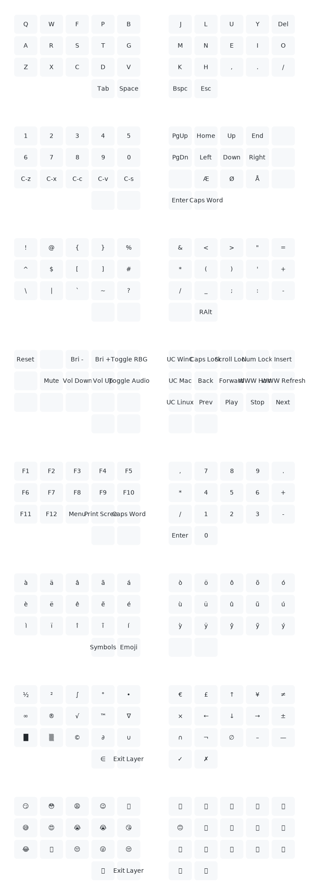

# keymap-viz: visualisation of keymaps

This is a Clojure program for generating visualisations of the keymaps of my keyboards, heavily inspired by [callum-oakley/keymap](https://github.com/callum-oakley/keymap) and the various spins on it.

